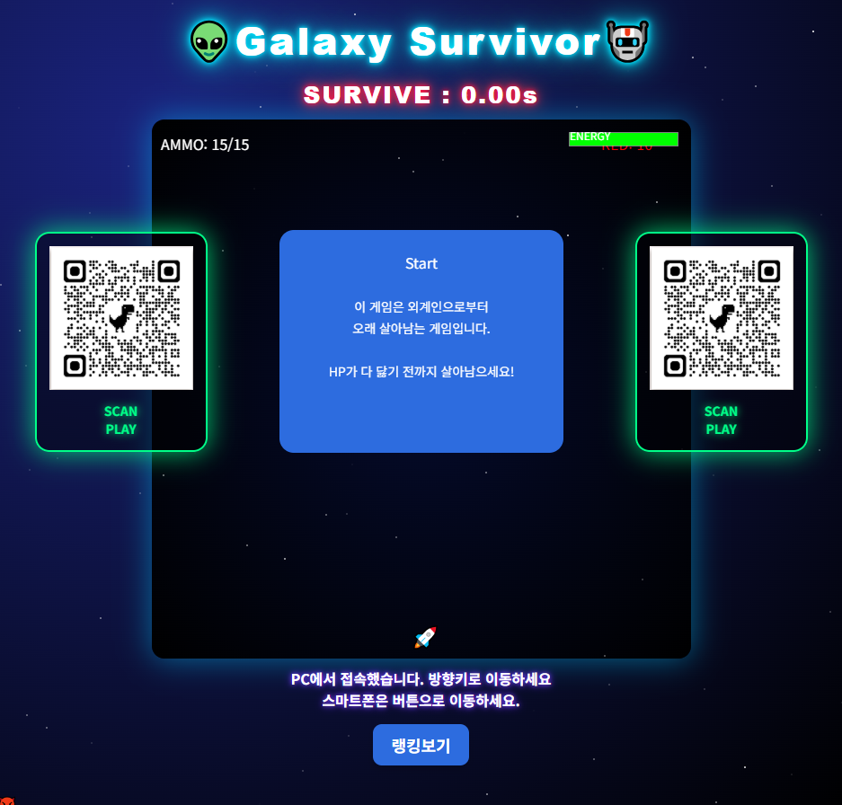

## 🎮 게임 스크린샷

# 👽 Galaxy Survivor 🤖

## 📌 프로젝트 소개

외계인을 피해 최대한 오래 생존하는 **HTML5 Canvas 기반 웹 게임**입니다.
플레이 시간은 기록되며, Firebase를 활용한 랭킹 시스템이 구현되어 있습니다.

---

## 🎮 주요 기능

* 🚀 방향키 이동 (PC) / 버튼 조작 (모바일 지원)
* 🔫 총알 발사 및 재장전 시스템
* ❤️ 체력 시스템 및 아이템 회복
* 👾 적 생성 및 난이도 점진적 증가
* 🏆 Firebase 기반 랭킹 저장 및 조회
* 🔊 사운드 ON / OFF 기능

---

## 🛠 기술 스택

* HTML5 Canvas
* JavaScript (Vanilla)
* Firebase Firestore (랭킹 데이터 저장)

---

## 🚀 실행 방법

1. [https://lms01-hub.github.io/galaxy-survivor-webgame/ 접속
2. https://buly.kr/H6jnWZY 접속

---

## 💡 개발 포인트

* requestAnimationFrame을 활용한 게임 루프 직접 구현
* 캐릭터 및 적의 충돌 판정 로직 구현
* 총알, 아이템, 체력 시스템 설계
* Firebase를 활용한 서버리스 랭킹 시스템 구축

---

## 🧠 느낀 점

* 게임 로직을 직접 구현하면서 이벤트 처리와 상태 관리의 중요성을 이해하게 되었음
* Firebase를 활용하여 백엔드 없이도 데이터 저장 기능을 구현할 수 있었음
* 향후에는 더 다양한 적 패턴과 UI 개선을 추가하고 싶음
